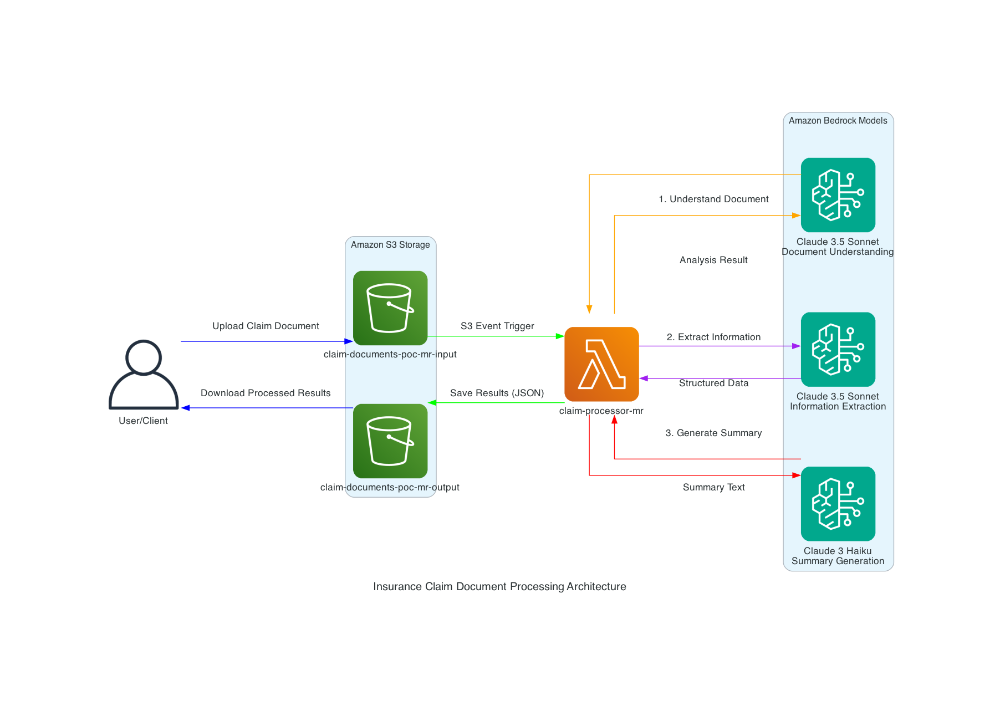

# Lab 01: Insurance Claim Document Processing

> **What you'll build:** A production-ready, serverless document processing pipeline that automatically extracts structured information from insurance claim documents using Amazon Bedrock foundation models.

## Overview

**The Scenario:** An insurance company receives hundreds of claim documents daily. Manual processing is slow, error-prone, and expensive. They need an automated system that can understand document structure, extract key information, and generate concise summaries—all while maintaining security and compliance.

**What You'll Build:** A fully serverless pipeline using Amazon S3 for storage, AWS Lambda for orchestration, and Amazon Bedrock (Claude models) for AI-powered document understanding, information extraction, and summary generation. Documents are processed automatically when uploaded, with results stored as structured JSON.

**Why It Matters:** This lab teaches you how to build production-ready AI applications on AWS. You'll learn event-driven architecture, multi-model orchestration, security best practices, and how to make informed decisions about model selection based on cost, quality, and latency trade-offs.

## Skill Builder & Certification Context

This lab is based on the **Bonus Assignment** from **Task 1.1: "Analyze requirements and design GenAI solutions"** in the AWS Skill Builder course: **"Exam Prep Plan: AWS Certified Generative AI Developer – Professional (AIP-C01)"**.

**About the Assignment:**
- The Bonus Assignment is intentionally open-ended, designed to assess your ability to analyze requirements, select appropriate AWS services, and design a complete GenAI solution
- This implementation represents one possible solution—there are many valid approaches
- All design choices, including service selection, model choices, and architectural patterns, are documented in [ADR.md](./ADR.md) with rationale and trade-offs
- AWS encourages sharing these assignments publicly using `#awsexamprep` to help others learn

**How This Fits into the Learning Journey:**

This lab appears early in the certification journey because it validates foundational skills essential for the AIP-C01 exam:
- **Architecture thinking** - Analyzing requirements and designing appropriate solutions
- **Service selection** - Choosing the right AWS services (S3, Lambda, Bedrock) for the use case
- **GenAI patterns** - Understanding when and how to use foundation models, multi-model orchestration, and event-driven AI workflows
- **Production considerations** - Security, cost optimization, error handling, and monitoring

Later labs in this journey will build on these concepts, exploring more advanced patterns like RAG, vector databases, and real-time inference. This foundation ensures you understand not just how to use AWS GenAI services, but how to design complete, production-ready systems.

> **Note for AIP-C01 Candidates:** This lab serves as a practical example of how to approach Bonus Assignments. Use it as inspiration for your own implementations, but remember that the assignment is open-ended—your solution may differ and still be valid. The key is demonstrating your understanding of requirements analysis, service selection, and architectural design. This repository does not reproduce exam questions or answers and is not intended as a shortcut to certification.

## Architecture



**The Flow:**
1. **User uploads** a claim document to the S3 input bucket (`claim-documents-poc-mr-input`)
2. **S3 event notification** automatically triggers the Lambda function
3. **Lambda orchestrates** three sequential Bedrock model invocations:
   - **Document Understanding** (Claude 3.5 Sonnet): Analyzes document structure and content
   - **Information Extraction** (Claude 3.5 Sonnet): Extracts structured data as JSON
   - **Summary Generation** (Claude 3 Haiku): Creates a concise summary
4. **Results are saved** to the S3 output bucket (`claim-documents-poc-mr-output`) as JSON
5. **User retrieves** processed results from the output bucket

**Key Design Decisions:**
- **Separate input/output buckets** prevent infinite loops (Lambda writing to input would retrigger itself)
- **Three-step pipeline** ensures comprehensive processing with quality checks
- **Model selection** balances cost and quality (Sonnet for complex tasks, Haiku for summaries)
- **Event-driven** architecture scales automatically and processes documents immediately

See [ADR.md](./ADR.md) for detailed architectural decisions and rationale.

## What You'll Learn

By completing this lab, you'll understand:

- ✅ **Serverless architecture patterns** - Building event-driven systems with S3, Lambda, and Bedrock
- ✅ **Multi-model AI orchestration** - Using different models for different tasks based on requirements
- ✅ **Model selection trade-offs** - When to use Sonnet vs Haiku, and why version matters
- ✅ **AWS Marketplace permissions** - How to enable Anthropic models automatically via IAM
- ✅ **Security best practices** - Encryption, versioning, least privilege IAM policies
- ✅ **Infrastructure as Code** - Deploying with Terraform and managing configuration
- ✅ **Production patterns** - Error handling, logging, monitoring, and cost optimization

## Prerequisites

**Required:**
- **AWS CLI** configured with credentials (`aws configure`)
- **AWS account** with permissions to create:
  - S3 buckets
  - Lambda functions
  - IAM roles and policies
  - CloudWatch Log Groups
- **Terraform >= 1.0** installed
- **Python 3.12+** (or 3.9+ with boto3 compatibility)

**Important: AWS Marketplace Access**
- Your AWS account must allow AWS Marketplace subscriptions
- The Lambda execution role includes Marketplace permissions, but your account administrator may need to approve Marketplace access
- Anthropic models (Claude) are distributed through AWS Marketplace

**Optional but Recommended:**
- AWS CloudShell or local terminal with AWS CLI
- Basic familiarity with Python and Terraform
- Understanding of JSON format

## Local Development

Run the document processor locally before deploying to AWS. This helps you understand the code flow and test with sample data.

### Step 1: Set Up Environment

```bash
cd labs/lab-01-claims-doc-processing/app
python -m venv venv
source venv/bin/activate  # On Windows: venv\Scripts\activate
pip install -r requirements.txt
```

### Step 2: Configure AWS Credentials

The code uses your default AWS credentials. Ensure they're configured:

```bash
aws configure
# Or set environment variables:
export AWS_ACCESS_KEY_ID=your-key
export AWS_SECRET_ACCESS_KEY=your-secret
export AWS_REGION=us-east-1
```

### Step 3: Configure Environment Variables

Create a `.env` file (optional, can use CLI args instead):

```bash
cp .env.example .env
# Edit .env with your configuration:
# AWS_REGION=us-east-1
# BEDROCK_MODEL_UNDERSTANDING=anthropic.claude-3-5-sonnet-20240620-v1:0
# BEDROCK_MODEL_EXTRACTION=anthropic.claude-3-5-sonnet-20240620-v1:0
# BEDROCK_MODEL_SUMMARY=anthropic.claude-3-haiku-20240307-v1:0
```

### Step 4: Process a Test Document

```bash
python main.py --input ../data/test-documents/claim-001-auto-accident.txt
```

**Expected Output:**
The command prints JSON to stdout with:
- `source_document`: File path and metadata
- `document_understanding`: Analysis of document structure
- `extracted_information`: Structured JSON with claim details
- `summary`: Concise summary text
- `processing_metadata`: Models used and timestamp

**Save to File:**
```bash
python main.py --input ../data/test-documents/claim-001-auto-accident.txt \
  --output result.json
```

**What Happens:**
1. Document is read from the local file
2. Three Bedrock model invocations occur sequentially
3. Results are formatted and returned as JSON
4. Processing typically takes 15-30 seconds (three model calls)

**Troubleshooting Local Runs:**
- **"Model access denied"**: Ensure your AWS credentials have Bedrock access and Marketplace permissions
- **"Region not supported"**: Use `us-east-1` or another region where Bedrock is available
- **"Invalid model ID"**: Check that the model IDs in your `.env` match the ADR recommendations

## Deploy with Terraform

Deploy the complete infrastructure to AWS. The Terraform configuration creates S3 buckets, Lambda function, IAM roles, and event notifications.

### Step 1: Navigate to Terraform Directory

```bash
cd labs/lab-01-claims-doc-processing/infra/terraform
```

### Step 2: Initialize Terraform

```bash
terraform init
```

This downloads the AWS provider and sets up the backend.

### Step 3: Review Configuration

Check `variables.tf` for customizable settings:
- `bucket_prefix`: Default `claim-documents-poc-mr` (change `mr` to your initials)
- `lambda_function_name`: Default `claim-processor-mr`
- `aws_region`: Default `us-east-1`
- `bedrock_models`: Model IDs for each task

### Step 4: Plan Deployment

```bash
terraform plan
```

Review the planned changes. You should see:
- 2 S3 buckets (input and output)
- 1 Lambda function
- 1 IAM role with policies
- 1 CloudWatch Log Group
- 1 S3 bucket notification

### Step 5: Apply Infrastructure

```bash
terraform apply
```

Type `yes` when prompted. Deployment takes 1-2 minutes.

**Expected Output:**
```
Apply complete! Resources: 7 added, 0 changed, 0 destroyed.

Outputs:

input_bucket_name = "claim-documents-poc-mr-input-123456789012"
output_bucket_name = "claim-documents-poc-mr-output-123456789012"
lambda_function_name = "claim-processor-mr"
lambda_function_arn = "arn:aws:lambda:us-east-1:123456789012:function:claim-processor-mr"
```

**Save these outputs** - you'll need them for testing.

### Step 6: Get Output Values

```bash
# Get input bucket name
terraform output -raw input_bucket_name

# Get output bucket name
terraform output -raw output_bucket_name

# Get Lambda function name
terraform output -raw lambda_function_name
```

### Cleanup

**Always destroy resources when done to avoid costs:**

```bash
terraform destroy
```

**Note:** If you see `BucketNotEmpty` errors, you need to empty the buckets first:
```bash
# Get bucket names
INPUT_BUCKET=$(terraform output -raw input_bucket_name)
OUTPUT_BUCKET=$(terraform output -raw output_bucket_name)

# Delete all objects and versions
aws s3api delete-objects --bucket $INPUT_BUCKET \
  --delete "$(aws s3api list-object-versions --bucket $INPUT_BUCKET \
  --query '{Objects: Versions[].{Key:Key,VersionId:VersionId}}')"

aws s3api delete-objects --bucket $OUTPUT_BUCKET \
  --delete "$(aws s3api list-object-versions --bucket $OUTPUT_BUCKET \
  --query '{Objects: Versions[].{Key:Key,VersionId:VersionId}}')"

# Then destroy
terraform destroy
```

## Test with Sample Documents

Test the deployed pipeline with the included sample documents.

### Step 1: Upload a Test Document

```bash
# Get bucket name
INPUT_BUCKET=$(cd infra/terraform && terraform output -raw input_bucket_name)

# Upload test document
aws s3 cp data/test-documents/claim-001-auto-accident.txt \
  s3://$INPUT_BUCKET/claims/claim-001-auto-accident.txt
```

**Important:** Files must be uploaded to the `claims/` prefix to trigger processing (configured in S3 event notification).

### Step 2: Monitor Lambda Execution

**Option A: CloudWatch Logs (Recommended)**
```bash
LAMBDA_NAME=$(cd infra/terraform && terraform output -raw lambda_function_name)
aws logs tail /aws/lambda/$LAMBDA_NAME --follow
```

**Option B: AWS Console**
1. Go to CloudWatch → Log Groups
2. Find `/aws/lambda/claim-processor-mr`
3. View the latest log stream

**Expected Log Output:**
```
INFO: Processing document: s3://claim-documents-poc-mr-input-.../claims/claim-001-auto-accident.txt
INFO: Document size: 1234 characters
INFO: Step 1: Document Understanding
INFO: Step 2: Information Extraction
INFO: Step 3: Summary Generation
INFO: Results saved to: s3://claim-documents-poc-mr-output-.../processed/claim-001-auto-accident.txt.json
```

### Step 3: Check Results

```bash
# Get output bucket name
OUTPUT_BUCKET=$(cd infra/terraform && terraform output -raw output_bucket_name)

# List processed files
aws s3 ls s3://$OUTPUT_BUCKET/processed/

# Download a result
aws s3 cp s3://$OUTPUT_BUCKET/processed/claim-001-auto-accident.txt.json ./result.json

# View the result
cat result.json | jq .  # or just: cat result.json
```

**Result Structure:**
```json
{
  "source_document": {
    "bucket": "claim-documents-poc-mr-input-...",
    "key": "claims/claim-001-auto-accident.txt",
    "processed_at": "2026-01-07T23:30:00Z"
  },
  "document_understanding": "{...analysis...}",
  "extracted_information": {
    "claimant_name": "John Doe",
    "policy_number": "POL-12345",
    "incident_date": "2025-12-15",
    "claim_amount": "$5,000",
    ...
  },
  "summary": "Concise summary of the claim...",
  "processing_metadata": {
    "models_used": {...},
    "processed_at": "..."
  }
}
```

### Step 4: Test with Multiple Documents

```bash
# Upload all test documents
for file in data/test-documents/claim-*.txt; do
  filename=$(basename $file)
  aws s3 cp $file s3://$INPUT_BUCKET/claims/$filename
  echo "Uploaded $filename"
done

# Wait a few seconds, then check results
sleep 10
aws s3 ls s3://$OUTPUT_BUCKET/processed/
```

## Configuration

### Environment Variables

The Lambda function uses these environment variables (set in Terraform):

| Variable | Description | Default |
|----------|-------------|---------|
| `INPUT_BUCKET` | S3 bucket for incoming documents | Set by Terraform |
| `OUTPUT_BUCKET` | S3 bucket for processed results | Set by Terraform |
| `BEDROCK_MODEL_UNDERSTANDING` | Model for document understanding | `anthropic.claude-3-5-sonnet-20240620-v1:0` |
| `BEDROCK_MODEL_EXTRACTION` | Model for information extraction | `anthropic.claude-3-5-sonnet-20240620-v1:0` |
| `BEDROCK_MODEL_SUMMARY` | Model for summary generation | `anthropic.claude-3-haiku-20240307-v1:0` |
| `ENABLE_MODEL_COMPARISON` | Enable model comparison feature | `false` |
| `COMPARISON_MODELS` | Comma-separated model IDs for comparison | `""` |

**For Local Development:**
Create `.env` file in `app/` directory (see `.env.example` if it exists, or set environment variables):

```bash
export AWS_REGION=us-east-1
export BEDROCK_MODEL_UNDERSTANDING=anthropic.claude-3-5-sonnet-20240620-v1:0
export BEDROCK_MODEL_EXTRACTION=anthropic.claude-3-5-sonnet-20240620-v1:0
export BEDROCK_MODEL_SUMMARY=anthropic.claude-3-haiku-20240307-v1:0
```

### Terraform Variables

Customize deployment in `infra/terraform/variables.tf` or create `terraform.tfvars`:

```hcl
bucket_prefix = "my-claim-documents"
lambda_function_name = "my-claim-processor"
aws_region = "us-west-2"
```

## Troubleshooting

### Bedrock Model Access Issues

**Error: "Model access is denied"**

**Cause:** Anthropic models require AWS Marketplace permissions.

**Solution:**
1. Verify IAM role has Marketplace permissions (included in Terraform):
   ```bash
   aws iam get-role-policy --role-name <lambda-role> --policy-name lambda_bedrock
   ```
   Should include `aws-marketplace:ViewSubscriptions` and `aws-marketplace:Subscribe`.

2. Ensure your AWS account allows Marketplace subscriptions:
   - Contact your AWS administrator
   - Check account settings in AWS Console

3. Try invoking the model once from AWS Console Bedrock Playground to enable it account-wide.

**Error: "Model ID not found" or "Invalid model ID"**

**Cause:** Model ID format is incorrect or model not available in your region.

**Solution:**
- Use exact model IDs from ADR: `anthropic.claude-3-5-sonnet-20240620-v1:0`
- Ensure you're using `v1:0` (not `v2:0`) for on-demand support
- Check Bedrock model availability in your region: `aws bedrock list-foundation-models --region us-east-1`

### IAM Permission Issues

**Error: "AccessDenied" when Lambda tries to access S3 or Bedrock**

**Cause:** Lambda execution role missing permissions.

**Solution:**
- Check Terraform applied successfully: `terraform show`
- Verify IAM role exists: `aws iam get-role --role-name <role-name>`
- Check CloudWatch Logs for specific permission errors

### Region Mismatch

**Error: "Bedrock not available in region"**

**Cause:** Bedrock models may not be available in all regions.

**Solution:**
- Use `us-east-1`, `us-west-2`, or `eu-west-1` (check [Bedrock regions](https://docs.aws.amazon.com/bedrock/latest/userguide/regions.html))
- Update `aws_region` in Terraform variables
- Redeploy: `terraform apply`

### S3 Event Not Triggering

**Symptom:** Document uploaded but Lambda not invoked.

**Causes & Solutions:**
1. **Wrong prefix:** Files must be in `claims/` prefix
   ```bash
   # ✅ Correct
   aws s3 cp file.txt s3://bucket/claims/file.txt
   
   # ❌ Wrong
   aws s3 cp file.txt s3://bucket/file.txt
   ```

2. **Event notification not configured:** Check Terraform applied S3 notification
   ```bash
   aws s3api get-bucket-notification-configuration --bucket <input-bucket>
   ```

3. **Lambda permission issue:** S3 needs permission to invoke Lambda
   - Terraform should configure this automatically
   - Check: `aws lambda get-policy --function-name <function-name>`

### Common Errors

**"Malformed input request"**
- **Cause:** Bedrock API format issue (should be fixed in code)
- **Solution:** Ensure you're using the latest code version

**"Timeout"**
- **Cause:** Lambda timeout too short (default 5 minutes should be sufficient)
- **Solution:** Increase timeout in Terraform if processing very large documents

**"Memory limit exceeded"**
- **Cause:** Document too large or memory too low
- **Solution:** Increase Lambda memory in Terraform (default 512 MB)

## Cost & Safety Notes

**Estimated Costs (us-east-1, approximate):**
- **S3 Storage:** ~$0.023/GB/month (minimal for test documents)
- **Lambda:** Free tier covers 1M requests/month
- **Bedrock (Claude 3.5 Sonnet):** ~$0.003/1K input tokens, ~$0.015/1K output tokens
- **Bedrock (Claude 3 Haiku):** ~$0.00025/1K input tokens, ~$0.00125/1K output tokens
- **CloudWatch Logs:** First 5 GB free, then ~$0.50/GB

**Per Document Processing Cost (approximate):**
- Small document (~500 tokens): ~$0.002-0.005
- Medium document (~2000 tokens): ~$0.01-0.02
- Large document (~5000 tokens): ~$0.03-0.05

**Safety Tips:**
- ⚠️ **Always destroy resources** when done: `terraform destroy`
- ⚠️ **Monitor CloudWatch** for unexpected invocations
- ⚠️ **Set up billing alerts** in AWS Console
- ⚠️ **Use test documents** - don't upload real sensitive data
- ⚠️ **Review IAM policies** - ensure least privilege

**Note:** Test documents in `data/test-documents/` are synthetic and safe to use.

## Lessons Learned

These insights come from building and deploying this system. They're documented in detail in [ADR.md](./ADR.md), but here are the key takeaways:

### Model Selection Rationale

**Why Claude 3.5 Sonnet v1 (not v2) for understanding/extraction:**
- v2 may not support on-demand throughput in all regions
- v1 is more stable and widely available
- Quality difference is minimal for document tasks
- **Trade-off:** Slightly older model, but better compatibility

**Why Claude 3 Haiku (not 3.5 Haiku) for summaries:**
- 3.5 Haiku v1 doesn't support on-demand throughput
- Haiku provides sufficient quality for summary generation
- ~10x cost savings vs Sonnet for this task
- **Trade-off:** Slightly lower quality, but acceptable for summaries

**Key Insight:** Model selection isn't just about quality—it's about balancing cost, latency, availability, and on-demand support. Always check model availability and throughput options in your region.

### Why Separate Input/Output Buckets

**The Problem:** If Lambda writes to the same bucket it reads from, it creates an infinite loop (write triggers event, event triggers Lambda, Lambda writes again...).

**The Solution:** Separate buckets with clear separation of concerns.

**The Benefit:** 
- Prevents infinite loops (AWS best practice)
- Allows different lifecycle policies
- Better security isolation
- **Trade-off:** Slightly more complex bucket management

**Key Insight:** AWS best practices exist for good reasons. Following them prevents production issues.

### Lambda Configuration Trade-offs

**Timeout (5 minutes):**
- Three Bedrock calls can take 15-30 seconds each
- Plus S3 read/write operations
- 5 minutes provides comfortable headroom
- **Trade-off:** Longer timeout = more cost if function hangs, but necessary for reliability

**Memory (512 MB):**
- Text processing doesn't need high memory
- Higher memory = faster CPU, but diminishing returns
- 512 MB is cost-effective for this workload
- **Trade-off:** Could use 256 MB to save cost, but 512 MB is safer

**Key Insight:** Lambda configuration is a balance between cost, performance, and reliability. Start conservative, optimize based on metrics.

### Three-Step Pipeline Benefits

**Why not single-step?**
- Single prompt trying to do everything reduces quality
- Harder to debug which part failed
- Less flexibility to optimize each step

**Why not parallel?**
- Understanding step provides context for extraction
- Sequential flow ensures quality
- Error handling is simpler

**Trade-off:** Higher latency (sequential) and cost (three invocations), but significantly better quality and maintainability.

**Key Insight:** Sometimes sequential processing is better than parallel. Quality and maintainability often outweigh raw speed.

### JSON Output Format

**Why JSON?**
- Structured, parseable, widely supported
- Self-contained (all info in one file)
- Easy to version and audit
- Human-readable for debugging

**Trade-off:** File-based (not queryable like a database), but perfect for this use case.

**Key Insight:** Choose output formats based on downstream needs. JSON is versatile and works well for most integrations.

### Security Defaults

**What we implemented:**
- S3 server-side encryption (SSE-S3)
- S3 versioning for audit trail
- Public access blocked
- Least privilege IAM policies
- Separate buckets for isolation

**Why not SSE-KMS?**
- Adds KMS key management complexity
- SSE-S3 is sufficient for most use cases
- Can upgrade later if needed

**Trade-off:** Slightly less control than KMS, but simpler and still secure.

**Key Insight:** Security is about defense in depth. Multiple layers provide better protection than one "perfect" layer.

### Log Retention (14 Days)

**Why 14 days?**
- Sufficient for debugging recent issues
- Prevents indefinite log accumulation
- Meets typical audit requirements
- Balances cost and utility

**Trade-off:** May lose logs for issues discovered after 14 days, but cost savings justify it.

**Key Insight:** Log retention is a cost/utility trade-off. 14 days is a good default for most applications.

### What We'd Do Differently

1. **Add Dead Letter Queue (DLQ)** for failed processing (future improvement)
2. **Implement retry logic** with exponential backoff
3. **Add CloudWatch alarms** for error rates and processing times
4. **Consider caching** document understanding results for similar documents
5. **Experiment with Haiku for extraction** to reduce costs (quality trade-off)

See [ADR.md](./ADR.md) "Future Considerations" for more ideas.

## Next Steps

**Improve the System:**
- Add PDF processing with Amazon Textract (currently only text files)
- Implement model comparison feature (code exists, enable via env var)
- Add Dead Letter Queue for failed processing
- Set up CloudWatch alarms and dashboards
- Experiment with different models to compare cost/quality

**Extend the Journey:**
- Build a frontend to upload documents and view results
- Add a database to store extracted information
- Implement user authentication and authorization
- Create a REST API using Amazon API Gateway
- Build a multi-tenant version

**Learn More:**
- Read [ADR.md](./ADR.md) for detailed architectural decisions
- Explore [Amazon Bedrock documentation](https://docs.aws.amazon.com/bedrock/)
- Review [AWS Lambda best practices](https://docs.aws.amazon.com/lambda/latest/dg/best-practices.html)
- Study [S3 event notifications](https://docs.aws.amazon.com/AmazonS3/latest/userguide/NotificationHowTo.html)

**Share Your Journey:**
- Tag your posts: `#AWSGenAI #LearnInPublic #AmazonBedrock`
- Share what you learned or improved
- Contribute back to this repository

---

**Questions? Issues?** Open an issue or start a discussion. We're here to help you learn! 🚀
